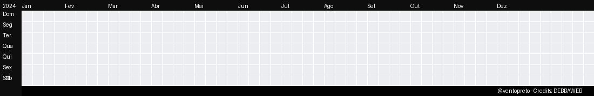

# Olá, eu sou Luiz Anjos (Vento)! 👋

---

✨ **Criando bugs (e soluções) desde:** 2019
 
📚 **Estou aprendendo atualmente:** Ruby (Async, Paralelismo e Concorrência) e Neovim (Nvim).
 
🎯 **Metas para o futuro:** Contribuir para um projeto open-source que eu admiro.
 
🎲 **Fato aleatório:** Meu apelido, **Ventopreto**, vem de uma música da banda Manowar ("*Born of black wind, fire and steel*"). A história ficou séria quando, em uma empresa, o time não conseguia conciliar a pessoa que subia as features (**ventopreto** no GitHub) com o usuário do Slack (**luiz anjos**). Para resolver o impasse, criaram o alias `@ventopreto` para mim. O apelido pegou e, nas dailies, todos já me chamavam assim. Hoje, pode me chamar só de **Vento**!

  

## 💻 Minhas Ferramentas

### **Dia a Dia**

### **Ambiente e Produtividade**

  

---
  
  
  
  
  )
  

---

### Contato

---

